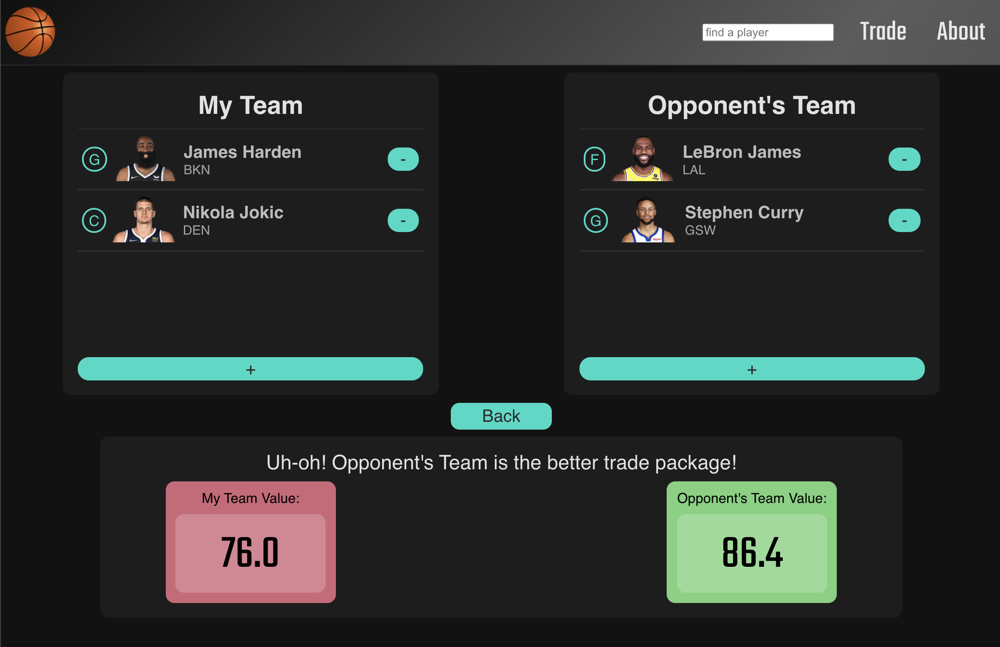
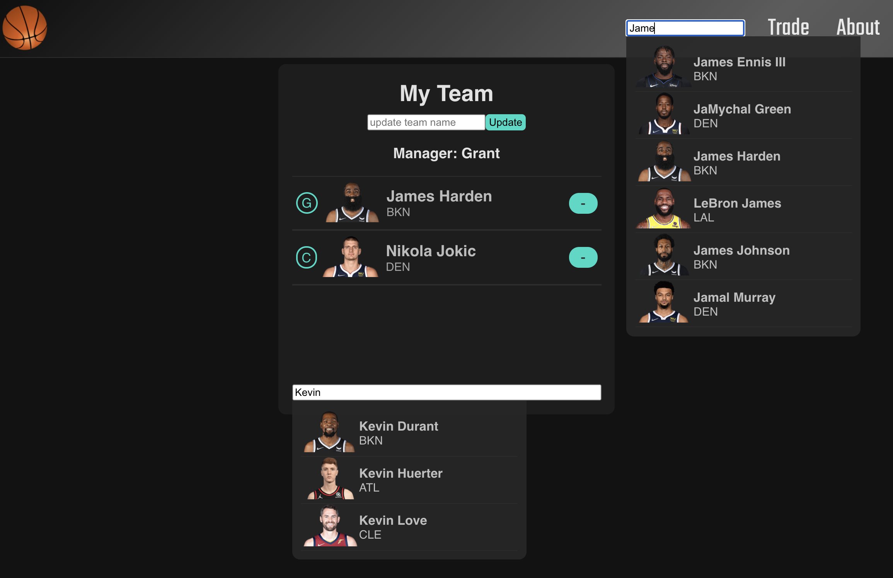

# **Fantasy Basketball Trade Analyzer**

### Grant Menke

### 12/23/2021

#### [GitHub](https://github.com/gmenke54) | [LinkedIn](https://www.linkedin.com/in/grant-menke-b81490223/)

---

A Full-stack proprietary Trade Analyzer for NBA Fantasy Basketball.

---

## **_Description_**

This is a full CRUD browser-based Fantasy Basketball Trade-Analyzer Program written in React.js, Mongoose, Express.js, and Node.js which I coded two weeks after being introduced to these languages.

---

## **_Screenshots_**

User Interface Mock-up:

Final Application Screenshots:

---

## **_Technologies_**

- React.js
- Mongoose
- MongoDB
- Express.js
- Node.js
- Javascript

---

## **_Roadmap (Future Updates)_**

- ~~Add Trade Analyzer Page~~
- Add User Authentication
- Refactor database to store each user's fantasy team(s)
- ~~Deploy on Heroku
- Refactor Trade Page to be temporary display that doesn't edit the database
- Add Live NBA Scores Page
- Make View Stats a more efficient page

---

## **_Getting Started_**

<!-- ADD DEPLOYED LINK HERE: -->
<!-- #### [Deployed on Heroku](grantopoly.surge.sh/) -->

The Entity Relationship Diagram and Component Hierarchy Diagram I used to develop this application can be found on my **[Trello Board](https://trello.com/b/AJQwrIwD/fbb-trade-analyzer-build)**

1. Navigate to the "trade" page
2. Enter Names of the Player(s) that each team is potenially trading
3. Press the "Analyze Trade" button
4. View the results

---

## **_Credits_**

**Fantasy Basketball Title Image:** [DuckDuckGo](https://www.legitgamblingsites.com/wp-content/uploads/2017/09/Fantasy-Basketball-with-court1-1024x499.jpg)

**Logo Designed Using:** [Canva](https://www.canva.com/)

**NBA Stats API:** [balldontlie.io](https://www.balldontlie.io/#introduction)

**Dark Theme Inspiration:** [material.io](https://material.io/design/color/dark-theme.html)

**NBA Historical Stats:** [nba.com](https://www.nba.com/stats/alltime/#!?SeasonType=Regular%20Season&PerMode=PerGame)

**NBA Player Pictures:** [Avinash Sarguru](https://medium.com/@avinash.sarguru/getting-nba-player-pictures-for-you-application-6106d5530943)
